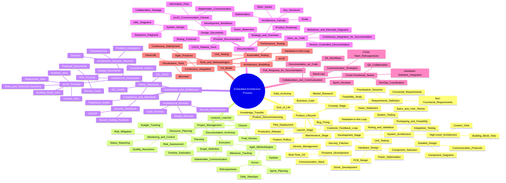

# Embedded Architecture Process Mindmap

<!-- more -->

```mermaid
mindmap
  root((Embedded Architecture Process))
    Product_Lifecycle
      Concept_Stage
        Market_Research
        Vision_Statement
        Feasibility_Study
        Business_Case
        Requirements_Definition
          Functional_Requirements
          Non-Functional_Requirements
          Epics_and_User_Stories
          Prioritisation_Sessions
      Development_Stage
        System_Architecture
          High-Level_Architecture
            Context_View
            Building_Block_View
          Detailed_Design
            Component_Diagrams
            Communication_Protocols
          Prototyping_and_Feasibility
        Hardware_Design
          PCB_Design
          Component_Selection
          Power_Optimisation
        Firmware_Development
          Real-Time_OS
          Driver_Development
          Communication_Stack
        Testing_and_Validation
          Unit_Testing
          Integration_Testing
          System_Testing
          Hardware-in-the-Loop
      Launch_Stage
        Pilot_Deployment
        Production_Release
        Customer_Feedback_Loop
      Maintenance_Stage
        Bug_Fixing
        Feature_Rollout
        Security_Patches
        Version_Management
      End_of_Life
        Product_Decommissioning
        Knowledge_Transfer
        Data_Archiving
    Project_Management
      Planning
        Scope_Definition
        Resource_Planning
        Risk_Assessment
        Timeline_Estimation
      Execution
        Agile_Methodologies
          Scrum
            Sprint_Planning
            Daily_Standups
            Retrospectives
          Kanban
        Milestone_Tracking
        Stakeholder_Communication
      Monitoring_and_Control
        Quality_Assurance
        Risk_Mitigation
        Budget_Tracking
        Status_Reporting
      Closure
        Final_Review
        Lessons_Learned
        Documentation_Archiving
    Governance_and_Architecture
      Architectural_Reviews
        Design_Reviews
        Code_Reviews
        Security_Assessments
      Architecture_Documents
        arc42_Template
          Context_View
          Building_Block_View
          Runtime_View
          Deployment_View
          Risks_and_Technical_Decisions
        Architecture_Decision_Records
          Problem_Description
          Considered_Options
          Decision
          Consequences
        RFC_Process
          Proposal_Documents
          Design_Documents
          Review_Cycle
      Compliance_and_Standards
        Safety_Standards
          ISO_26262
          IEC_61508
        Security_Standards
          OWASP
          Secure_Coding_Practices
        Regulatory_Audits
    Documentation
      Strategy_and_Overview
        Vision_Statement
        Product_Roadmap
        Architecture_Canvas
          Goals
          Key_Decisions
          Stakeholders
          Open_Issues
      Design_Documents
        arc42_Communication_Canvas
          Stakeholder_Communication
          Information_Flow
          Collaboration_Strategy
        System_Design
          UML_Diagrams
          Sequence_Diagrams
      Process_Documentation
        Development_Workflows
        Testing_Protocols
        CI/CD_Pipeline_Docs
      Docs_as_Code
        Version_Controlled_Documentation
        Continuous_Integration_for_Documentation
        Markdown_and_Mermaid_Diagrams
    Collaboration_and_Communication
      Cross-Functional_Teams
        Hardware-Software_Integration
        DevOps_Coordination
        QA_Collaboration
      Communication_Strategies
        Stand-Ups
        Sprint_Reviews
        Cross-Team_Retrospectives
      Documentation_as_Code
        Git_Workflows
        Pull_Requests_for_Documentation
    Tools_and_Methodologies
      Agile_Practices
        Continuous_Integration
        Continuous_Deployment
      Architecture_Modelling
        C4_Model
        arc42
      Visualisation_Tools
        PlantUML
        Mermaid
      Automated_Testing
        Unit_Testing
        Hardware-in-the-Loop
        Performance_Testing
```
